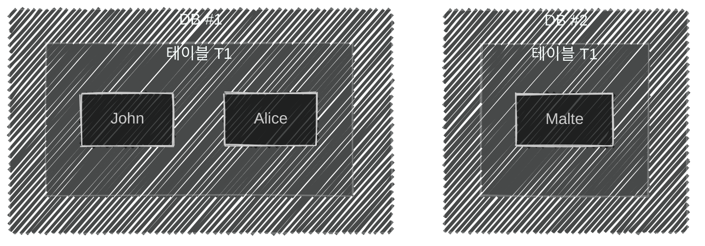
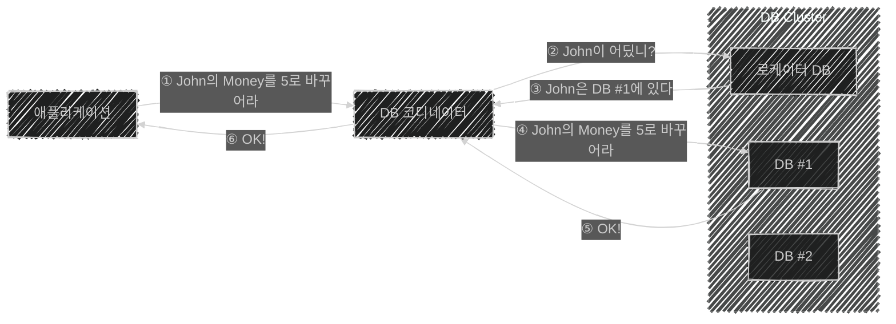
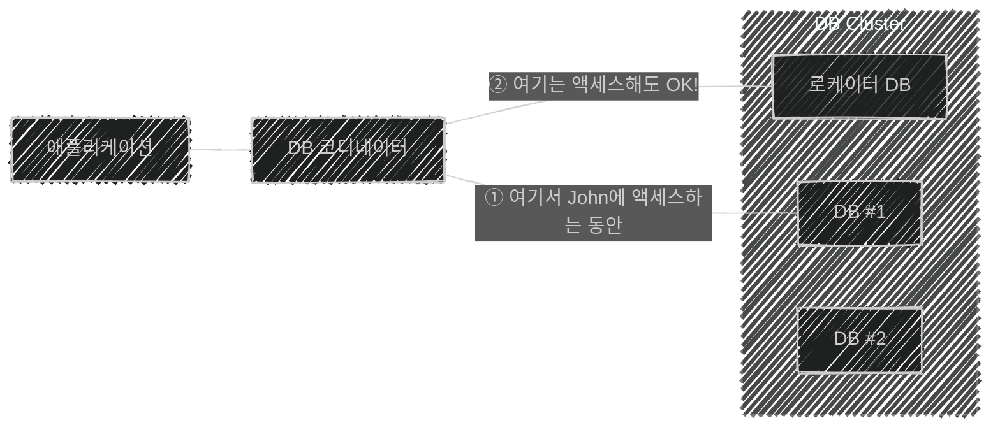

이 글은 아래의 책을 자세히 정리한 후, 정리한 글을 GPT에게 요약을 요청하여 작성되었습니다.  
게임 서버 프로그래밍 교과서, 배현직 저자
{: .notice--warning}

# 📦 8. NoSQL 기초
## 👉🏻 2. 관계형 데이터베이스에서 확장성

### 📌 상황

- 사용자가 많아, 게임 서버를 **하드웨어 여러 대**로 구성

---

### 📐 수직 분산

- 여러 테이블을 여러 데이터베이스 컴퓨터에 담는 것
- **한계점:** 테이블이 10개, 데이터베이스 컴퓨터가 100개인 경우 **90대가 남아돈다.**

---

### 📊 수평 분산

- 테이블 한 개에 있는 레코드 1억 개를 데이터베이스 컴퓨터 100대에 분산시킨다.
- 분산된 테이블의 조각을 **샤드**라고 한다.

**John 샤드를 찾는 방법:**
1. **해시 함수 사용:** John 문자열로 해시 함수를 실행하고, 나온 정수 값을 샤드 넘버로 사용한다.
2. **로케이터 DB 사용:** John → 샤드 위치를 알려주는 별도 테이블을 만들고 액세스한다.
   - 두 번째 방법을 사용한다.

---

### 🗺️ 로케이터 DB

- 데이터에 변화가 생기면 로케이터 DB에도 변화가 있어야 하므로, **원자성과 일관성**을 제공해야 한다.

---

### 🔐 분산 락

- 둘 이상의 기기에 저장된 데이터를 액세스하는 동안, 해당 데이터 액세스를 **블로킹**시켜주는 것
- 데이터베이스 일관성을 지킬 수 있지만, **처리 속도에 문제**가 생긴다.
- 데이터베이스 샤드가 많을수록, **분산 처리 효과가 퇴색**된다.

---

### ⚖️ 일관성과 원자성을 포기하는 경우

- **락의 강도를 낮추면** 수평 분산의 효과를 제대로 볼 수 있다.
- 락에 따른 처리 성능 하락이 발생하지 않는다.
- 하지만, **일관성을 보장할 수 없어진다.**