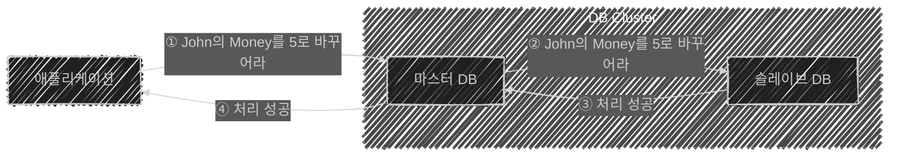

이 글은 아래의 책을 자세히 정리한 후, 정리한 글을 GPT에게 요약을 요청하여 작성되었습니다.  
게임 서버 프로그래밍 교과서, 배현직 저자
{: .notice--warning}

# 📦 8. NoSQL 기초
## 👉🏻 3. 관계형 데이터베이스에서 고가용성

### 📌 개념 정리

- **고가용성:** 서버 기기가 정상 작동하지 않을 때도, 사용자 입장에서 서비스가 지속되는 상태를 유지하는 것
- **장애 극복:** 고가용성을 위한 기법 중 하나

---

### 🔁 데이터베이스 다중화 (Redundancy)

- DB를 2개 두고, 두 데이터베이스 내용이 같도록 유지하는 것
- **액티브 (마스터):** 평소 액세스하는 데이터베이스
- **패시브 (슬레이브):** 예비로 준비해놓는 데이터베이스

---

### 🔒 일관성을 중요시 하는 경우 (ACID)

- 모든 처리가 끝날 때까지 **블로킹**된다.
- 데이터베이스 **처리 성능이 하락**한다.
- **ACID**를 추구한다: 원자성 / 일관성 / 고립성 / 지속성

---

### ⚡ 일관성을 포기하는 경우 (BASE)

- **일관성이 깨진다:** 최신이 아닌 데이터인 **스테일 데이터(stale data)** 를 가져올 수 있다.
- **고가용성과 처리 성능**을 확보할 수 있다.
- **BASE (Basically Available)** 를 추구한다.
    - ACID에서 C(일관성)와 I(고립성) 일부를 포기한 방식이다.

---

### 🌐 BASE

- **NoSQL**이 해당 방식을 사용한다.
- 데이터베이스가 **소프트 스테이트(soft state)** 로, 일시적으로 데이터 상태가 변화 중일 수 있다.
- **결과적 일관성(eventual consistency):** 일시적으로 데이터 일관성이 깨지지만, 언젠가는 일관성을 재구축한다.
- 일관성을 일부 희생해 **확장성과 고가용성**을 실현한다.