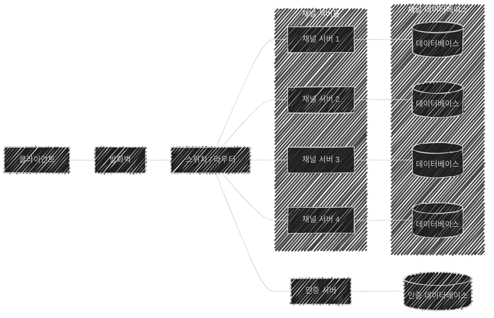

이 글은 아래의 책을 자세히 정리한 후, 정리한 글을 GPT에게 요약을 요청하여 작성되었습니다.  
게임 서버 프로그래밍 교과서, 배현직 저자
{: .notice--warning}

# 📦 9. 분산 서버 구조
## 👉🏻 3. 고전적인 서버 분산 방법

### 🗺️ 분산 게임 서버 구조

- `게임 서버, 데이터베이스` 세트를 나열하는 것으로 분산 게임 서버를 구현할 수 있다.
- 서버 클러스터(서버의 집합)는 **인증 서버 1대, 채널 서버 4대**로 이루어져 있다.

---

### 🔐 인증 서버

- 사용자의 **ID/PW 입력을 인증 처리**하는 역할
- 구성
    - 인증을 처리하는 **로직 서버** (확장할 수는 있지만, 할 필요는 없다.)
    - 사용자 인증을 위한 **데이터베이스**

---

### 🔄 클라이언트/서버 상호작용

1. 클라이언트는 **인증 서버에 접속**하고, ID/PW를 통해 로그인 처리
2. **채널 서버 선택** 및 접속

---

### 💡 특징

- **국가별로 채널을 분리**하는 것이 일반적이다.
- 채널 선택 과정을 없애, **하나의 채널만 있는 것처럼** 보이게 할 수 있다.