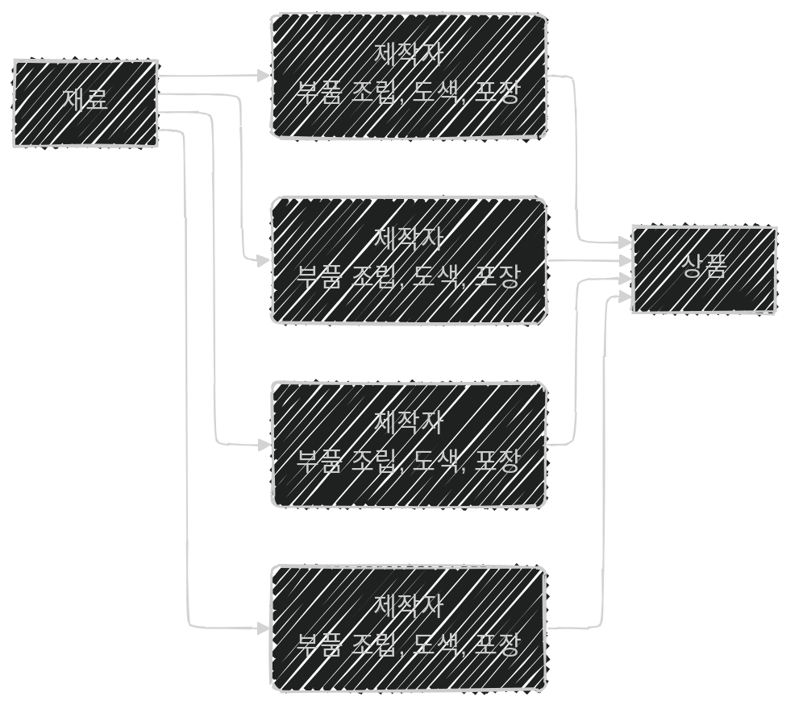
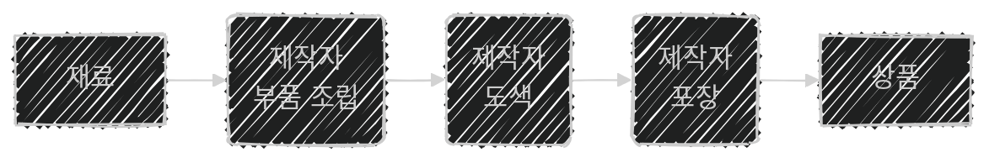

이 글은 아래의 책을 자세히 정리한 후, 정리한 글을 GPT에게 요약을 요청하여 작성되었습니다.  
게임 서버 프로그래밍 교과서, 배현직 저자
{: .notice--warning}

# 📦 9. 분산 서버 구조
## 👉🏻 5. 데이터 분산 vs 기능적 분산

### 📦 데이터 분산

- 한 머신이 처리해야 하는 데이터를 **같은 역할을 하는 여러 머신**이 나누어 처리하는 것

---

### ⚙️ 기능적 분산

- 한 머신이 처리해야 하는 데이터의 **처리 단계를 세분화**한다.
- 이후, 여러 머신이 나누어 처리한다.

---

### 🗄️ 데이터베이스에서의 분산

- 게임 서버와 비슷하다.
- **데이터 단위 분산**
    - 테이블 1개를 테이블 안의 **키 필드 단위**로 분배
    - e.g. 레코드 10억 개가 있는 테이블 1개 → 데이터 서버 10개로 분배
    - **파티셔닝**이라고 한다.
- **기능 단위 분산**
    - 서로 다른 테이블을 **서로 다른 서버**에 배치
    - e.g. Account 테이블, ItemData 테이블 → 각각 다른 데이터베이스 서버로 분배