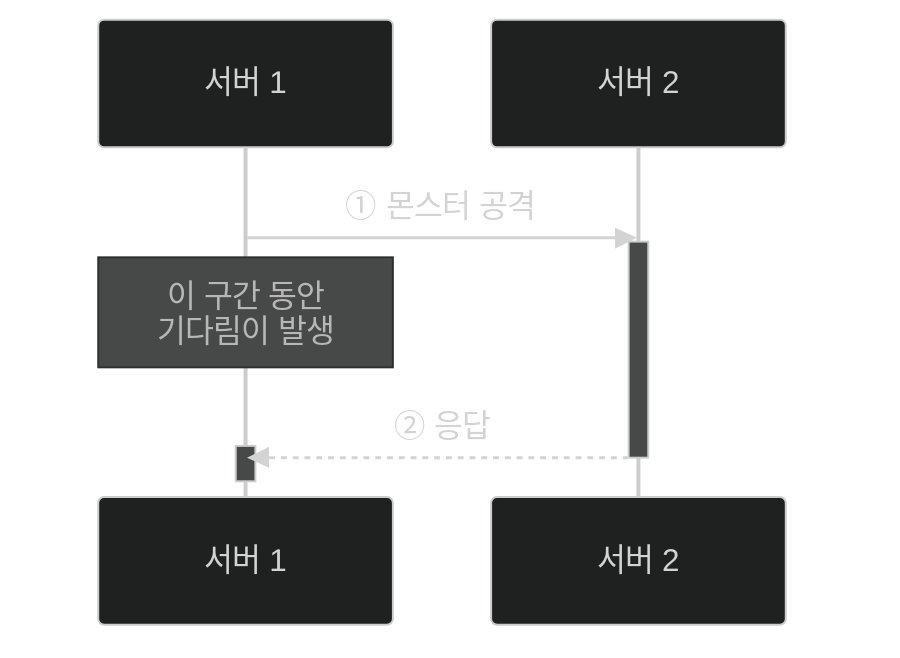
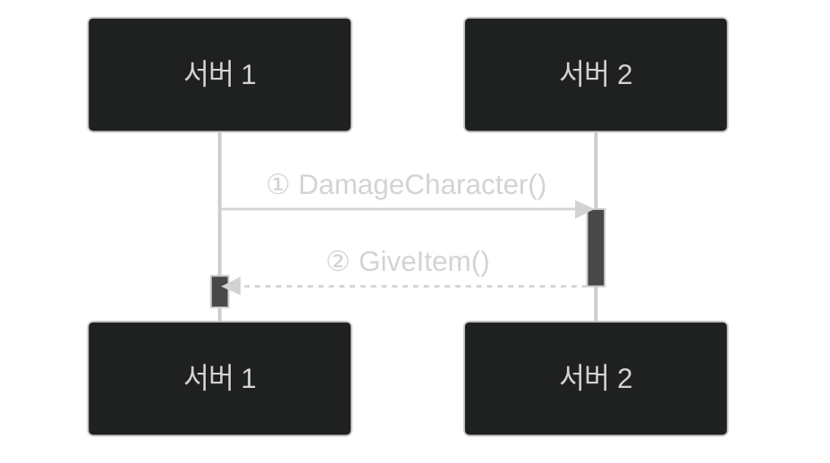
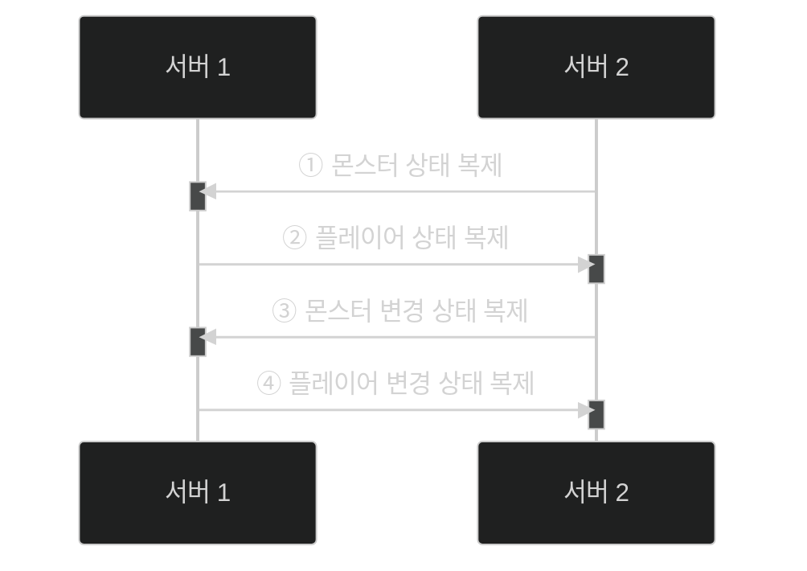
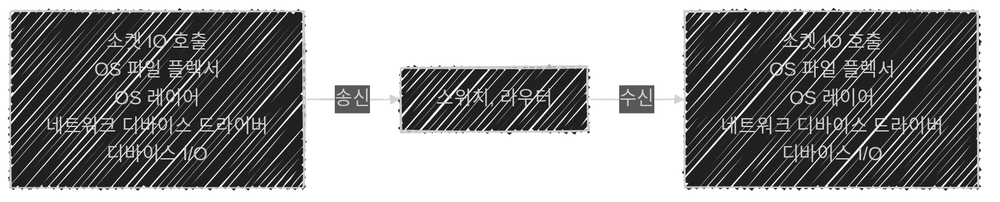

이 글은 아래의 책을 자세히 정리한 후, 정리한 글을 GPT에게 요약을 요청하여 작성되었습니다.  
게임 서버 프로그래밍 교과서, 배현직 저자
{: .notice--warning}

# 📦 9. 분산 서버 구조
## 👉🏻 6. 로직 처리의 분산 방식들

### 📌 개요

- 게임 로직 분산 처리 방식은 크게 아래와 같이 나뉜다.
    - **동기 분산 처리**
    - **비동기 분산 처리**
    - **데이터 복제 및 로컬 처리**
- 머신들 간에 분산 처리를 할 일이 없는 것이 좋으나, 해야 한다면 위 세 가지 중 선택해야 한다.

---

### 🔰 분산 처리 전

```cpp
Player_Attack(player, monster) {
	player.bullet--;
	monster.hitPoint -= 10;
	if(monster.hitPoint < 0) {
		player.item.Add(gold, 30);
		DeleteEntity(monster, 10sec);
	}
}
```

- 서버 1, 서버 2가 있어도 **서버 1에서만** 해당 로직이 실행된다.
    - 서버 1에서만 플레이어/몬스터 정보를 가지고 있다.

---

### 🔒 1. 동기 분산 처리

### 방법 1: 동기식 명령 처리법

- 대기, 잠금이 필요하다.
- 서버 1은 플레이어, 서버 2는 몬스터 정보를 가지고 있다.



```cpp
Player_Attack(player, monster) {
	lock(player) {
		player.bullet--;
		e = otherServer.DamageCharacter(
			player.id, monster.id, 10);
		waitForResult(e);
		if(e.hitPoint < 0) {
			player.item.Add(gold, 30);
		}
	}

	DamageCharacter(attacker, character, damage) {
		character.hitPoint -= damage;
		result.hitPoint = character.hitPoint;
		Reply(result);
	}
}
```

**과정:**

1. 몬스터를 공격하면, 플레이어 정보부터 잠근다.
2. 플레이어 정보를 업데이트한다.
3. 서버 2에 공격 명령을 전송하고, **대기**한다.
4. 서버 2는 몬스터 정보를 업데이트하고, 응답한다.
5. 서버 1은 대기를 풀고, 나머지 처리를 진행한다.

---

### 방법 2: 동기식 데이터 변경법

- 일관성을 지키며, 데이터에 액세스한다.
- **분산 락 기법**이 동반된다.

```cpp
Player_Attack(player, monster) {
	lock(player) {
		player.bullet--;
		otherServer.RemoveLock(monster); // 1
		m = otherServer.RemoteGet(monster.id); // 2
		m.hitPoint -= damage;
		if(m.hitPoint < 0) {
			player.item.Add(gole, 30);
			otherServer.RemoteDelete(monster.id); // 3
		}
		else {
			otherServer.RemoteSet(m); // 3
		}
		otherServer.RemoteUnlock(m); // 4
	}
}
```

**과정:**

1. 서버 2에 "몬스터 정보 액세스를 위해 분산 락을 걸겠다." 요청하고 응답받음
2. 서버 2에서 몬스터 정보 얻음
3. 서버 2에 몬스터 정보 업데이트
4. 서버 2에 분산 락 해제 요청하고 응답받음

**문제점:**

- 서버 1에서 서버 2로 요청/응답까지 **대기**해야 한다.
    - 대략 수십~수백 마이크로초가 걸린다.
- 위 코드의 경우 메시지 왕복이 총 **3번**이다.
- **암달의 법칙**
    - 임계 영역이나 뮤텍스가 광범위해지면, 대기 시간이 급격히 길어진다.
    - 처리 성능 병목 문제는 조금만 증가해도 전체 성능이 급격히 떨어진다.
    - 즉, 병렬 처리할 수 있는 장치에서 병렬로 처리하지 못하는 시간에 비례해 **병렬 효과가 급감**하는 현상을 의미한다.

**개선:**

- 멀티스레드 혹은 멀티 프로세스로 작동한다.
- **뮤텍스의 잠금 범위**를 좁힌다.
- 서버 1과 서버 2 사이의 **네트워크 레이턴시**를 줄인다.
    - Infiniband로 묶는 방법이 있다.

---

### ⚡ 2. 비동기 분산 처리



1. 서버 1은 연산 명령을 서버 2에 송신한다.
2. 서버 1은 서버 2의 명령 처리 결과를 **대기하지 않고**, 다음 할 일을 시작한다.
- 게임 개발 이외의 영역에서 사용하는 처리 방식이다.
    - **MPI(메시지 패싱 인터페이스)** 혹은 **액터 모델**이라고 부른다.

```cpp
Player_Attack(player, monster) {
	player.bullet--;
	otherServer.DamagerCharacter(player.id, monster.id, 10);
}

DamageCharacter(callerServer, attacker, character, damage) {
	character.hitPoint -= damage;
	if(character.hitPoint < 0) {
		callerServer.GiveItem(attacker.id, gold, 30);
		DeleteEntity(character, 10sec);
	}
}

GiveItem(character, item, amount) {
	character.item.Add(item, amount);
}
```

**특징:**

- 잠금으로 인한 **병목이 없다.**
- 모든 로직을 해당 방식으로 구현하기 **어렵거나 불가능하다.**
    - 반환 값을 주고받을 수 없기 때문이다.
    - 반환 값이 없는 함수만으로 구현하는 것과 유사하다.
- **서로 일방적인 통보**를 하는 방식으로 구현해야 한다.

---

### 📋 3. 데이터 복제에 기반을 둔 로컬 처리



- 가지고 있는 데이터에 변경이 일어나면, **나머지 서버에도 전파**된다. (데이터 복제)
- 서버 1, 2 모두 플레이어와 몬스터에 대한 정보를 가지게 된다.
    - 로직은 각 서버가 알아서 처리한다.
    - 즉, 서버 프로세스 안의 **원본과 사본**을 가지고 연산을 수행한다.
- 사본 데이터는 원본 데이터와 간발의 차이로 생기는 **스테일 데이터** 문제가 생길 수 있다.
    - 데이터를 모두 신뢰하면, 잘못된 연산이 발생할 수 있다.
    - 이를 **하이젠버그**라고 한다.

```cpp
Player_Attack(player, monster) {
	player.bullet--;
	monster.hitPoint -= 10;
	if(monster.hitPoint < 0) {
		player.item.Add(gold, 30);
		DeleteEntity(monster, 10sec);
	}
}
```

- 분산 처리 전 코드와 **동일하다.**

---

### ⚠️ 공통된 문제



1. 소켓의 송수신 함수(`send`, `sendTo`, `epoll`, `IOCP`, …)를 사용하게 된다.
2. 서버의 운영체제는 기계어 명령어로 많은 일을 하게 된다.
- **핵심 처리**를 위한 기계어 명령어는 수십~수백 개이다.
- **분산 서버 간 대화**를 위한 기계어 명령어는 수천 개가 된다.
- 즉, 과도하게 분산 처리를 하면 **비효율적**이 될 수 있다.