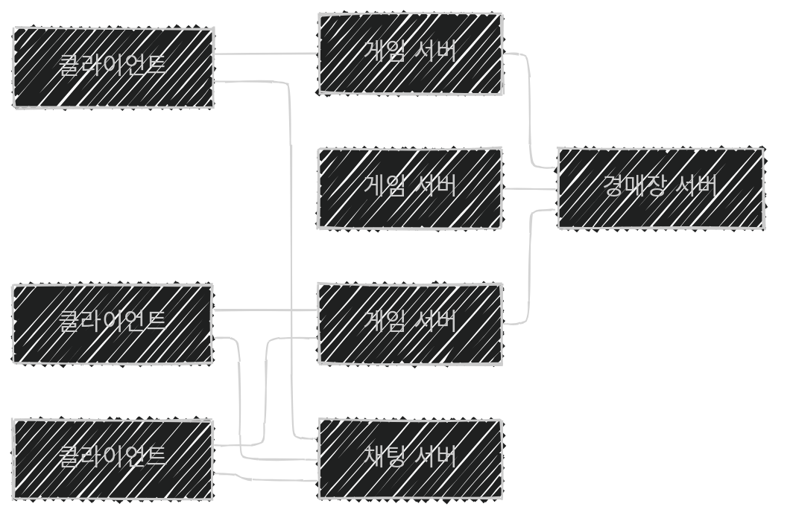

이 글은 아래의 책을 자세히 정리한 후, 정리한 글을 GPT에게 요약을 요청하여 작성되었습니다.  
게임 서버 프로그래밍 교과서, 배현직 저자
{: .notice--warning}

# 📦 9. 분산 서버 구조
## 👉🏻 8. 기능적 분산 처리

### 📌 수평 분산 처리를 하지 못하는 경우

- **동기 분산 처리:** 암달의 법칙이 심하게 작용
- **비동기 분산 처리:** 요청과 응답을 받아야 함
- **데이터 복제 기반 분산 처리:** 데이터 일관성이 깨짐

---

### ⚙️ 기능적 분산 처리 (수직 분산 처리)

- 경매장 같은 경우 **수직 분산 처리** 사용
- 수평 분산 처리보다 **분산 효율성이 떨어지므로**, 최후의 수단이다.

---

### 🏪 경매장을 수직 분산 처리로 구현한 예

