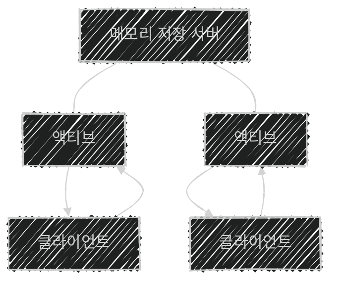
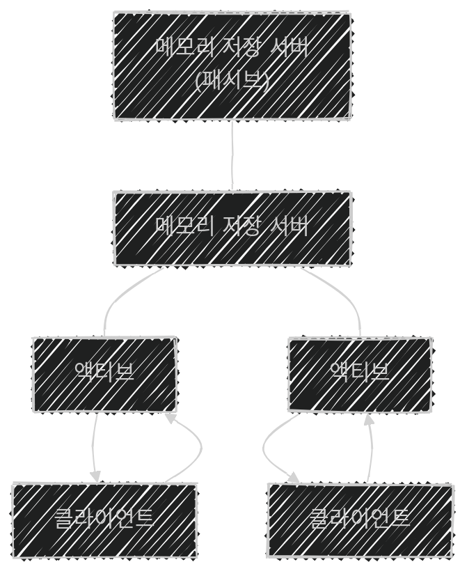

이 글은 아래의 책을 자세히 정리한 후, 정리한 글을 GPT에게 요약을 요청하여 작성되었습니다.  
게임 서버 프로그래밍 교과서, 배현직 저자
{: .notice--warning}

# 📦 9. 분산 서버 구조
## 👉🏻 12. 고가용성

### 📌 개념 정리

- **고가용성:** 서버가 고장난 상황에서도 나머지 서버가 본 서버의 역할을 지속해, 사용자가 항상 서비스를 이용할 수 있게 하는 것
- **장애 극복:** 서버 클러스터에 있는 서버 중 하나가 죽었을 때, 다른 서버가 이어받고 회복하는 것
- **이중화/다중화:** 장애 극복을 위해 필요 이상(예비)의 서버를 두는 것

---

### 🔄 1. 액티브-패시브 패턴

- 액티브 서버는 활성화된 서버이며, 패시브 서버에게 지속적으로 **데이터를 복제**시킨다.
- 액티브 서버가 죽은 경우, **패시브 서버가 액티브 서버로 활동**한다.
    - 기존 액티브 서버는 패시브 서버가 된다.
- 패시브 서버는 다른 역할을 하지 않으므로, **서버 자원이 낭비**된다.

---

### ⚡ 2. 액티브-액티브 패턴

- 두 서버의 상태를 지속적으로 **동기화**한다.
- 액티브 서버가 죽은 경우, **다른 액티브 서버로 요청이 몰린다.**
- 동시에 두 서버의 특정 데이터에 접근하는 경우, **데이터 스테일 문제**가 발생할 수 있다.

### 데이터 스테일 문제 해결: 메모리 저장 서버

- 각 서버는 **메모리 저장 서버**에 읽기/쓰기를 하고 응답을 받는다.
- 데이터에 접근할 때마다 기기 간 통신이 발생하므로, **비효율적**이 될 수 있다.

### 메모리 저장 서버 이중화

- **메모리 저장 서버도 이중화** 할 수 있다.

---

### 🌐 추가 내용

- **서버 오케스트레이션 도구:** 다수의 서버를 쉽게 관리하는 도구
- 서버 클러스터는 **데이터센터**에 있으며, 데이터센터 시설을 **가용 지역(AZ)** 라고 한다.
- **다중 AZ 이중화:** 데이터센터의 사고를 대비해, 추가 증설한 서버를 다른 AZ에 있도록 한다.
    - 대신, AZ 간 통신에 걸리는 **시간과 비용이 크다.**