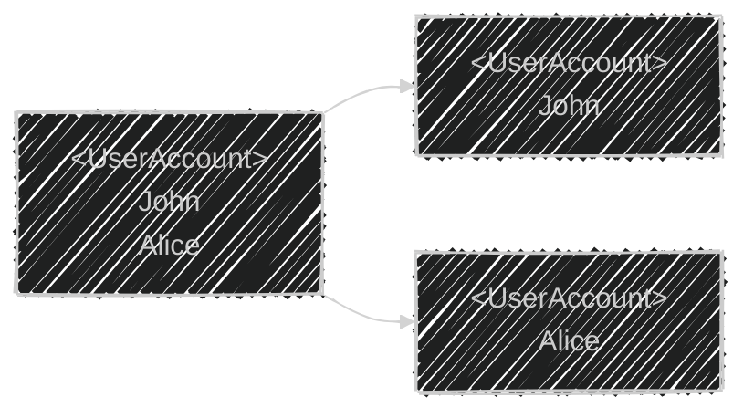
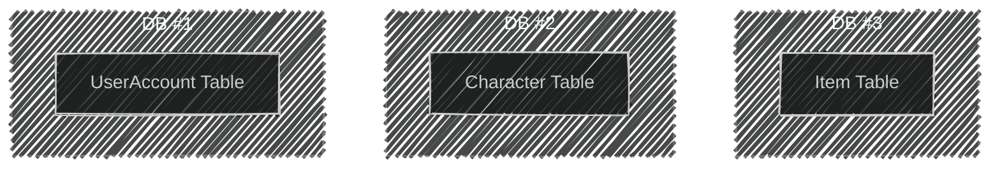
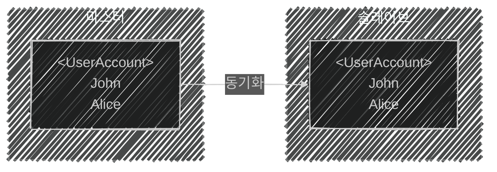

이 글은 아래의 책을 자세히 정리한 후, 정리한 글을 GPT에게 요약을 요청하여 작성되었습니다.  
게임 서버 프로그래밍 교과서, 배현직 저자
{: .notice--warning}

# 📦 9. 분산 서버 구조
## 👉🏻 13. 데이터베이스의 분산

### 📌 개요

- 게임 서버 분산 처리만 아니라, **데이터베이스 분산 처리**도 있다.
- **파티셔닝:** 레코드들을 서로 다른 데이터베이스에 나누는 것

---

### 📊 수평 파티셔닝

---

### 📋 수직 파티셔닝

---

### 🔁 데이터베이스 이중화

