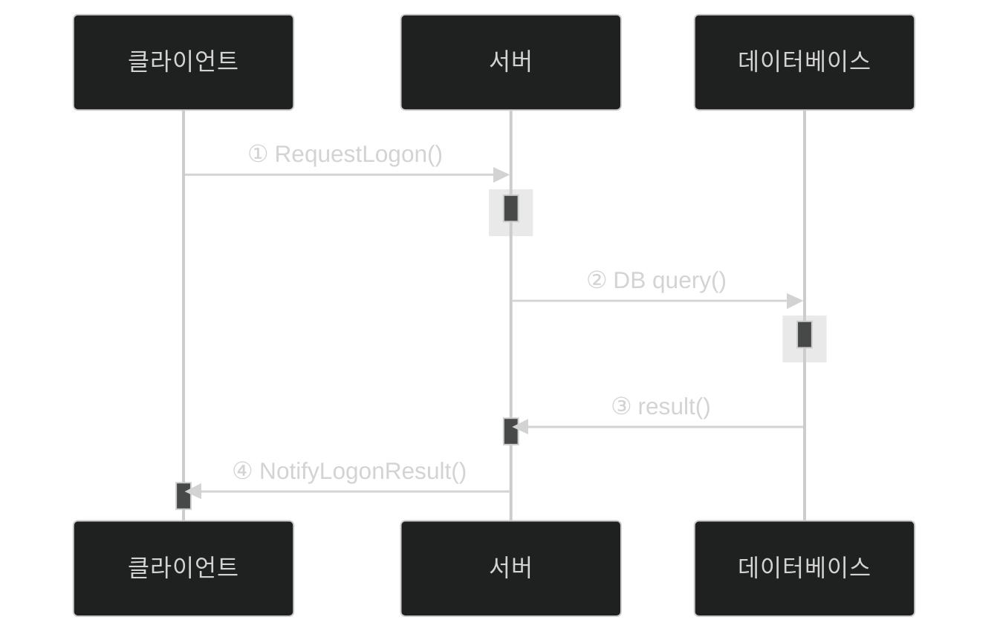
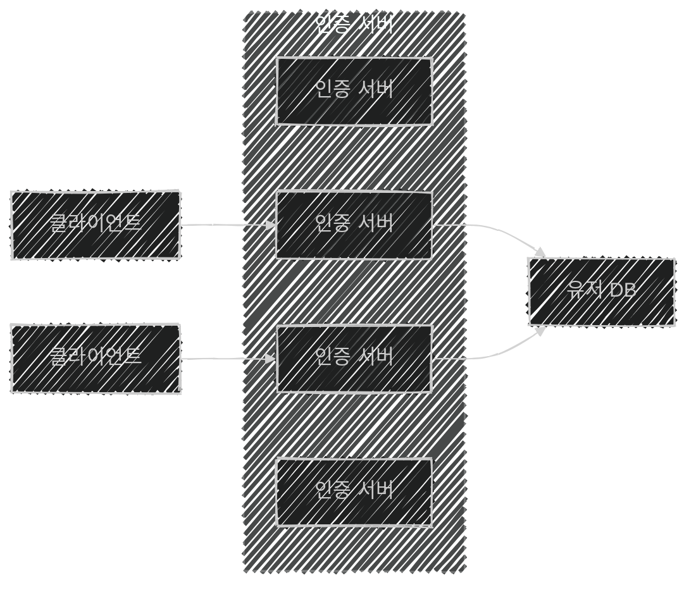
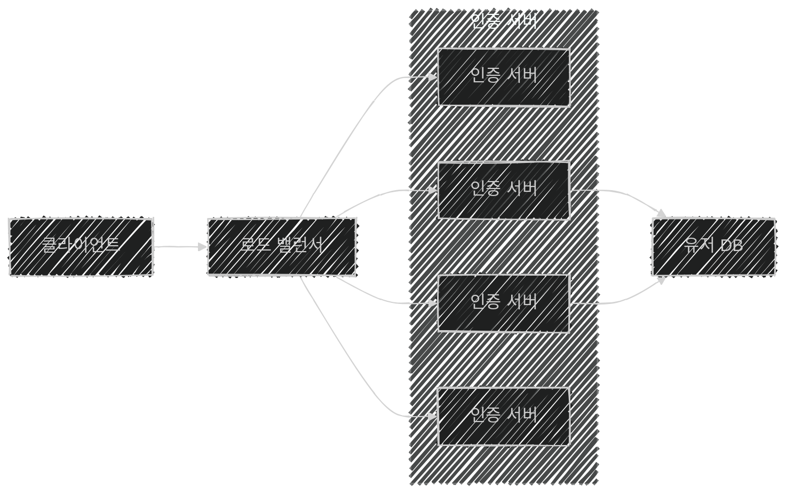
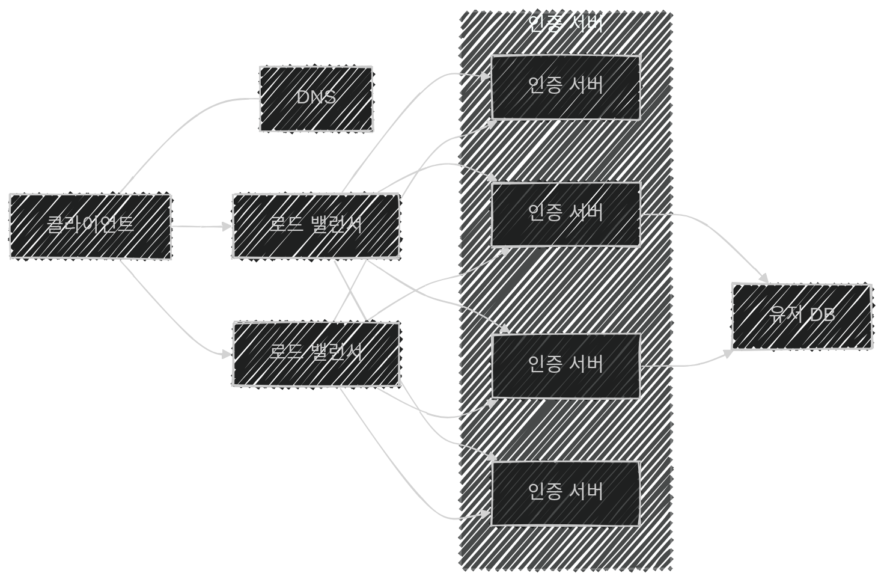

이 글은 아래의 책을 자세히 정리한 후, 정리한 글을 GPT에게 요약을 요청하여 작성되었습니다.  
게임 서버 프로그래밍 교과서, 배현직 저자
{: .notice--warning}

# 📦 10. 분산 서버 구조 사례
## 👉🏻 1. 로그온 처리의 분산

### 🔐 로그온 처리 과정

- **① 요청:** 클라이언트는 서버에 ID/PW 암호화 후 전송, 인증 서버에서 수신 후 메시지 복호화
- **② 질의:** 서버는 복호화된 메시지에서 ID/PW를 구하고, DB에 질의를 던지고 응답 대기
- **③ 결과:** DB에서 질의 수행 후 결과 전송
- **④ 응답:** 서버에서 결과 판단 후, 클라이언트에게 응답

동시접속자 수가 많아지면, **회색 부분**에서 과부하가 발생한다.

- 로그온 메시지 복호화 연산 과정
- 질의 분석과 디스크 스토리지 액세스

---

### 🔀 로그온 서버 수평 확장

- 클라이언트는 인증 서버 중 하나에 접속한다.
- **서버 주소 목록 중 랜덤**으로 하나를 선택해 접속한다.
- 클라이언트는 서버 주소 목록을 알고 있다고 가정한다.

---

### ⚖️ 로드 밸런서

- **로드 밸런서:** 클라이언트 연결들을 인증 서버로 분배해주는 하드웨어
- 클라이언트가 서버 주소 목록을 가지고 있다면, 로드 밸런서를 사용해도 된다.

---

### 📈 로드 밸런서 수평 확장

- 로드 밸런서에 과부하가 걸리는 경우, **로드 밸런서 추가 / DNS 서버**를 통해 해결할 수 있다.
- DNS 서버는 **랜덤하게 로드 밸런서 서버 주소**를 반환한다.
    - DNS는 IP 주소를 확보하면, 며칠간 **로컬 디스크에 저장**해둔다.
    - 그러므로, DNS는 과부하가 걸릴 일이 거의 없다.