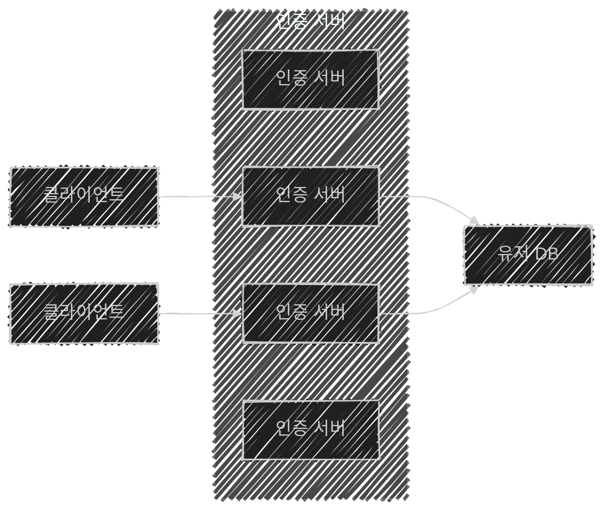
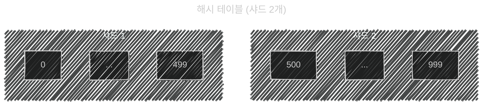
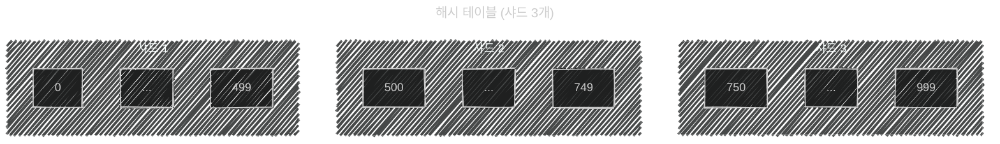
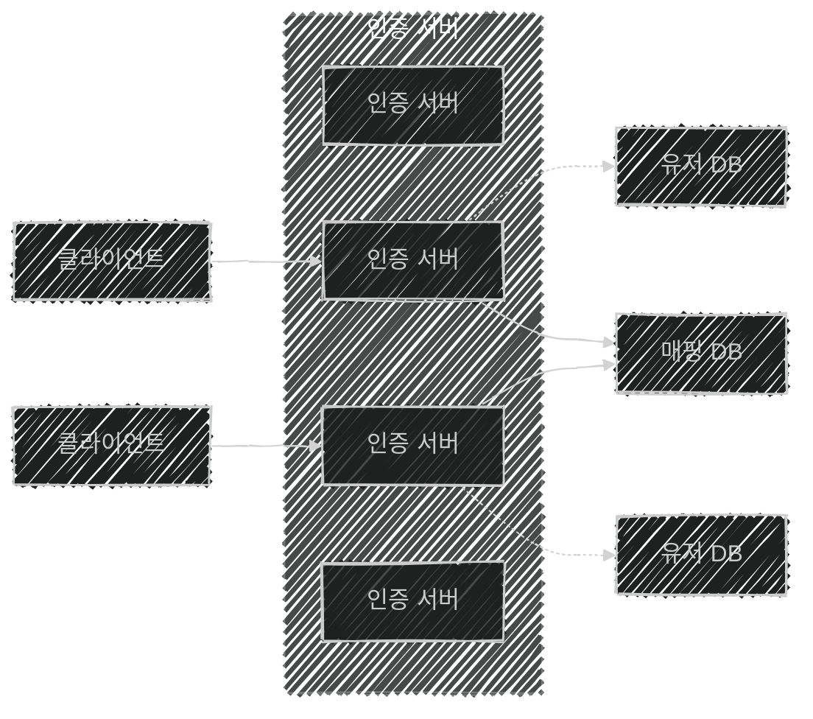
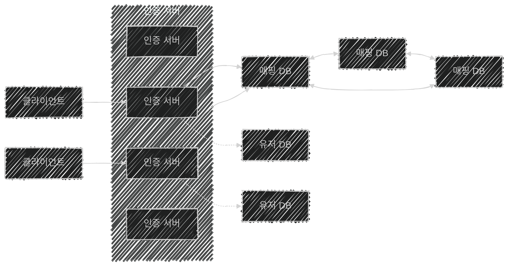
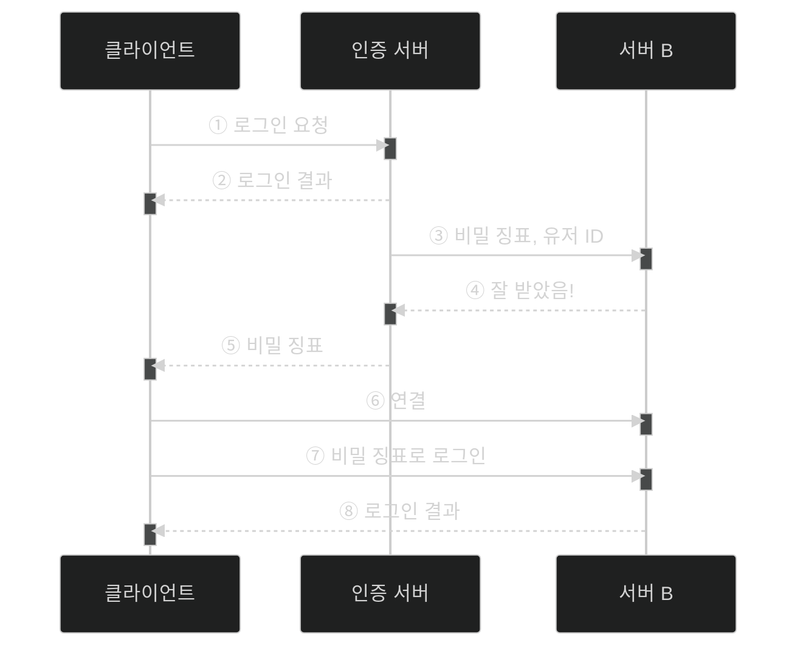

이 글은 아래의 책을 자세히 정리한 후, 정리한 글을 GPT에게 요약을 요청하여 작성되었습니다.  
게임 서버 프로그래밍 교과서, 배현직 저자
{: .notice--warning}

# 📦 10. 분산 서버 구조 사례
## 👉🏻 2. 데이터베이스의 수평 확장

### 📌 상황

- DB 서버는 여전히 과부하
- 플레이어 간 상호작용은 없다는 전제

**수평 확장:**

- 플레이어 정보를 **여러 샤드**에 저장
    1. 클라이언트는 인증 서버 접속, ID/PW 전송
    2. 서버는 `ID → 해시 함수`를 통해, DB **샤드 인덱스** 획득
    3. 해당 샤드에 질의 전송
- 샤드 인덱스를 얻기 위해 사용된 키(ID)를 **샤드 키(파티션 키)** 라고 한다.
- 더 많은 서버가 필요하면, 인증 서버/데이터베이스 샤드 증설
    - 그러나 데이터베이스 샤드를 늘리는 일은 **단순하지 않다.**

---

### 🔧 데이터베이스 샤드 증설

- 샤드 10개에서 11개로 늘리려 하면 **리해시**가 발생한다.
    - 항목 개수가 달라지므로, 데이터 항목 재배치가 필요해진다.
    - 기존 레코드도 리해시해주어야 한다.
- **문제점:** 리해시해야 하는 레코드가 많으면, 게임 서버를 **장시간 점검**해야 한다.

**해결 방법:**

1. 레코드 이동 개수 최소화 → **일관된 해시 알고리즘** 사용
2. 이동할 일이 없게 만듦 → **매핑 DB**
3. 레코드 이동 크기 최소화

---

### 1️⃣ 레코드 이동 개수 최소화: 일관된 해시 알고리즘

- 샤드 개수 변동 1개 당, **샤드 1개만 재배치 연산**을 수행하면 된다.

- 일반적인 해시 테이블은 항목이 해시 함수 값에 **일대일 대응**된다.

- 항목 개수를 많게 **고정**시킨다.
- 이제 샤드 1개는 해시 함수 값 **다수에 대응**된다. → 해시 값들의 집합

| 해시 | 항목 | 샤드 |
| --- | --- | --- |
| hash("A") | 17 | 1 |
| hash("B") | 23 | 1 |
| hash("C") | 745 | 2 |

- **샤드 추가:** 기존 샤드가 맡던 해시 집합을 두 샤드가 나누어 가진다.
- **샤드 삭제:** 기존 샤드가 맡던 해시 집합을 인접 샤드에 나누어 준다.

**특징:**

- 해시 테이블은 **링형**이라고 보아야 한다. (샤드 3과 1은 인접)
- **일부 레코드에만** 리해시해주면 된다.
- 샤드가 크게 늘어나거나 줄어들 때 결국 많은 양을 리해시해야 한다.

---

### 2️⃣ 매핑 DB

- `입력(키) → 샤드 인덱스`를 가지는 DB를 따로 만든다.

1. 클라이언트: 인증 서버 중 하나 접속
2. 인증 서버: 매핑 DB에 질의 → **DB 인덱스(샤드 넘버)** 획득
3. 인증 서버: 해당 DB에 플레이어 관련 CRUD 질의 수행
- **샤드 추가:** 레코드 이동 없이 채우기만 하면 된다.
- **샤드 제거:** 매핑 DB에서 레코드 이동, 유저 DB에서 바뀐 위치 반영 필요
- 매핑 DB에 과부하가 걸리면 의미가 없다. → **단일 실패 지점(SPOF)**

- 매핑 DB에도 **확장성을 추가**한다. → 레코드를 여러 샤드에 나눈다.

---

### 🔄 접속 프로세스 시퀀스

1. 클라이언트: 인증 서버 중 하나 접속
2. 인증 서버: 매핑 DB 중 선택 → DB 인덱스(샤드 넘버) 획득
3. 인증 서버: 해당 DB에 CRUD 질의 수행
- 한 서버에서 인증하고 나서, 다른 서버에서 또 거치는 것은 **비효율적**이다.

---

### 🎫 인증 정보 Credential

- 한번 인증하고 나면, **비밀 증표(Credential)** 를 통해 재인증할 필요가 없도록 한다.