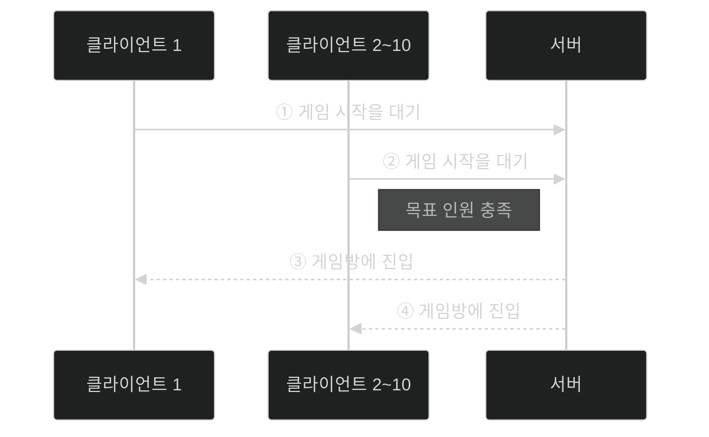
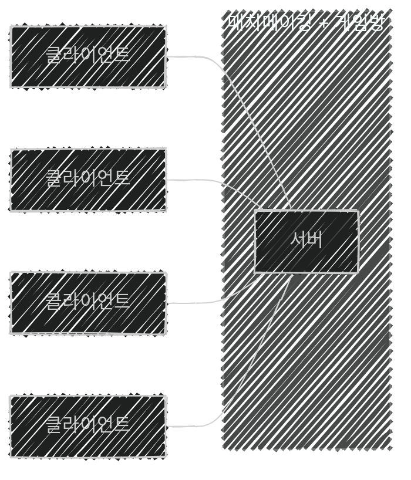
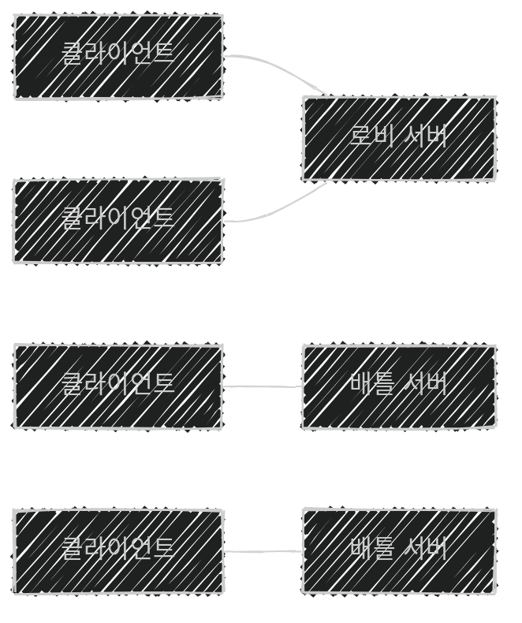
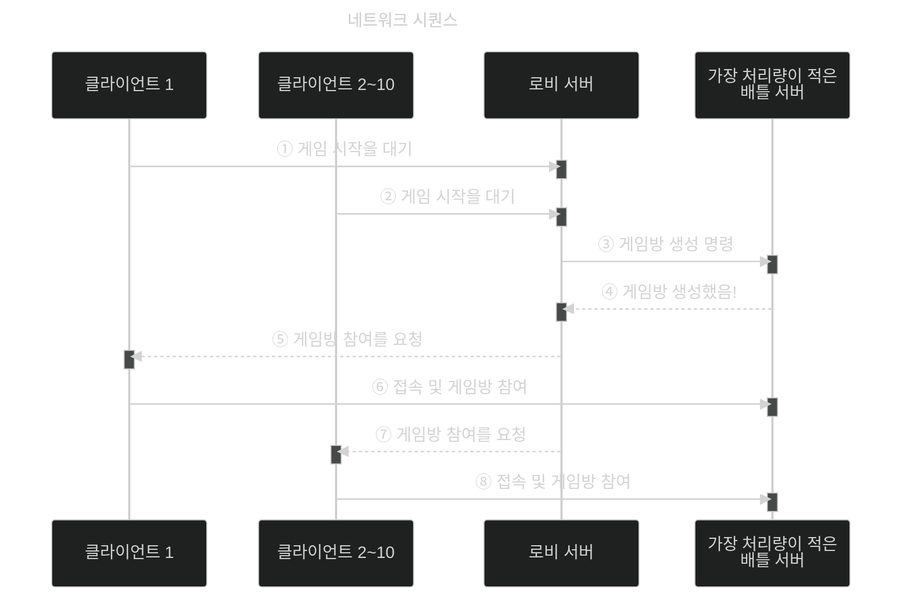
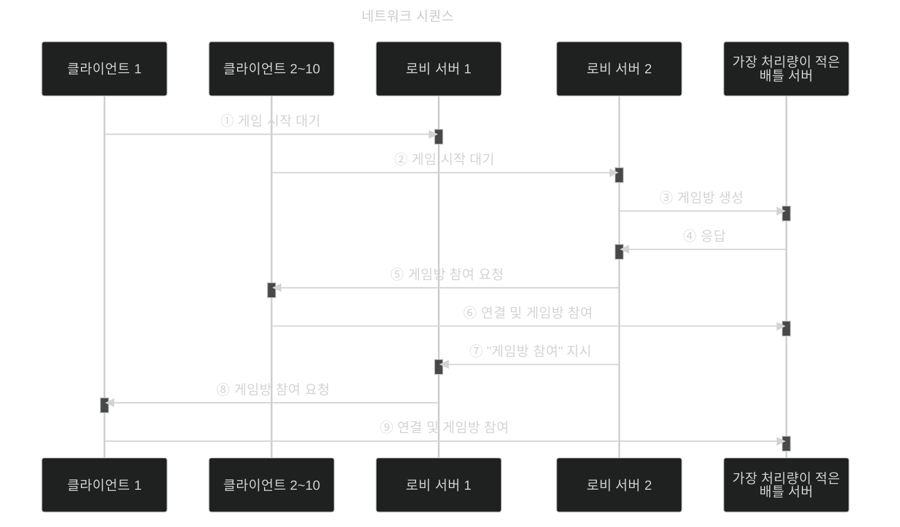
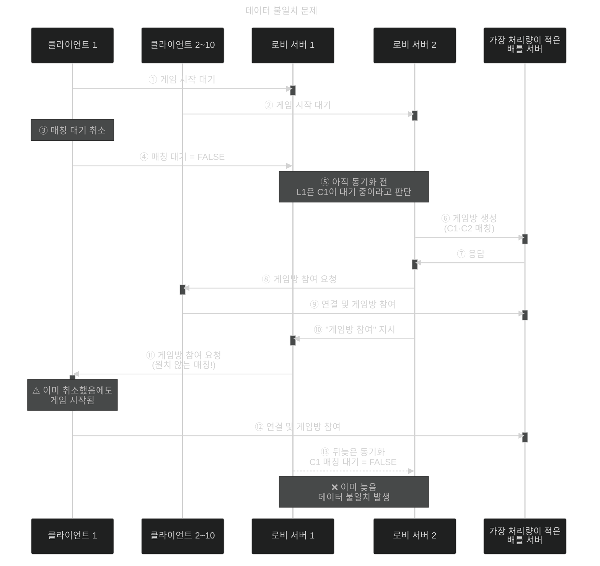

이 글은 아래의 책을 자세히 정리한 후, 정리한 글을 GPT에게 요약을 요청하여 작성되었습니다.  
게임 서버 프로그래밍 교과서, 배현직 저자
{: .notice--warning}

# 📦 10. 분산 서버 구조 사례
## 👉🏻 3. 매치메이킹의 분산 처리

### 📌 개념 정리

- **매치메이킹:** 플레이를 위해 다른 플레이어를 찾는 것
- **로비 서버:** 매치메이킹을 담당하는 서버

---

### 🔰 서버 분산 전

- 단일 서버에서 **과부하 지점**을 찾는다.
- 월드 시뮬레이션, 동시 접속자 몰림으로 인해 **CPU/RAM이 과부하**될 수 있다.

---

### ⚔️ 배틀 서버 분산

- 서로 다른 게임방 혹은 다른 리전끼리는 **응집력이 낮으므로 분산**해야 한다.
    - 게임방을 처리하는 서버를 **배틀 서버**라 한다.
    - 배틀 서버 여럿과 로비 서버로 나눔으로써, **플레이 중 레이턴시**도 줄일 수 있다.
- 로비 서버 클러스터는 **한 리전**에 두어도 된다.

- 클라이언트는 배틀 서버에 접속할 때, **인증 정보(Credential)** 를 사용한다.

---

### 🏠 로비 서버 분산

로비 서버들은 아래의 데이터를 주고받아야 한다.

- 플레이어 실력 정보
- 매칭 대기 중 여부

**통신 방법 선택:**

| 방법 | 결과 | 이유 |
| --- | --- | --- |
| 동기 분산 처리 | ❌ | 통신 횟수가 너무 많아짐 |
| 비동기 분산 처리 | ❌ | 응답을 받지 못함 |
| 데이터 복제 기반 로컬 처리 | ✅ | 서버 간 통신으로 플레이어 목록 동기화 |

- ①②에서 플레이어 정보 변화를 **로비 서버들끼리 동기화**시킨다.
- ⑤에서 서버는 **인증 정보(Credential)** 를 주고, 클라이언트는 ⑥에서 이를 사용한다.
- ⑦에서 로비 서버는 다른 로비 서버에게 **간접적으로 지시**한다.

**문제점 / 해결법:**

1. 플레이어/로비 서버가 정말 많다면, 로비 서버끼리 **엄청난 양의 통신량**이 발생한다.
    - **응집도가 높은** 같은 실력의 플레이어끼리만 매칭시킨다.
    - 응집도가 낮은 플레이어의 데이터는 **동기화하지 않는다.**
2. 로비 서버 간 **데이터 불일치(스테일 데이터)** 문제 → 아래에서 따로 알아보자.

---

### ⚠️ 로비 서버간 데이터 불일치 문제

- **매칭 취소** 직전에 매칭이 성사되는 경우가 대표적이다.
- ④를 통해 로비 서버 1은 클라이언트 1의 취소 사실을 알고 있다.
    - 로비 서버 2에 원상 복구하라 알리는 방법이 있지만, 클라이언트 2~10은 이미 배틀 서버로 이동 중이다.
    - **자동으로 매치메이킹을 재시작**하는 수밖에 없다.

**또 다른 해결법:**

- **메모리 저장 서버를 따로 두어 접근하는 방식**을 사용할 수도 있다.
    - [이곳](https://softhamzzi.github.io/gameserver/game_server_9_12/)에서 다루었었다.
    - 데이터 접근 시마다 기기 간 통신이 발생하므로, **비효율적**일 수 있다.
    - **로비 서버 연산량이 많고, 메모리 저장소 서버 연산량이 적을 때** 효과적이다.