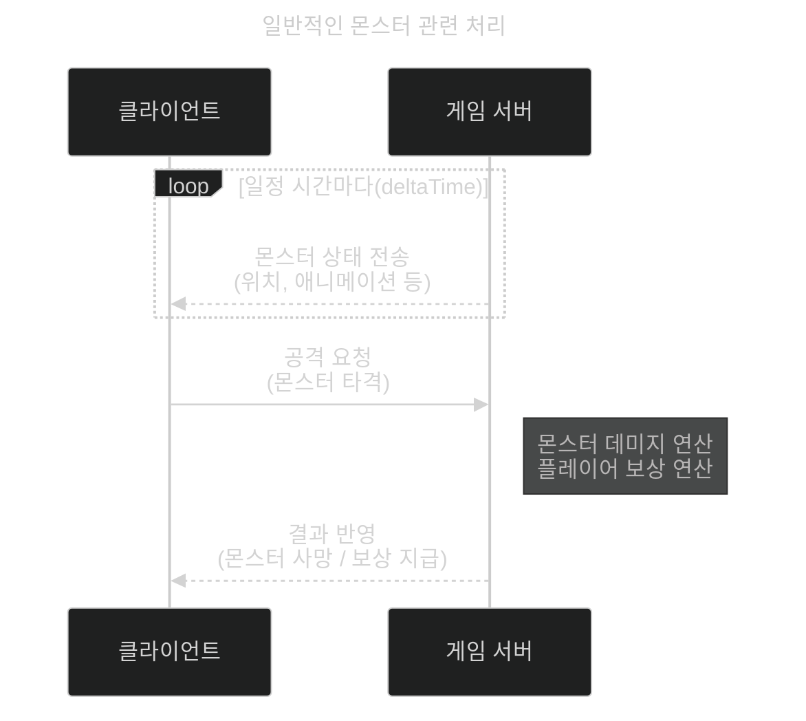
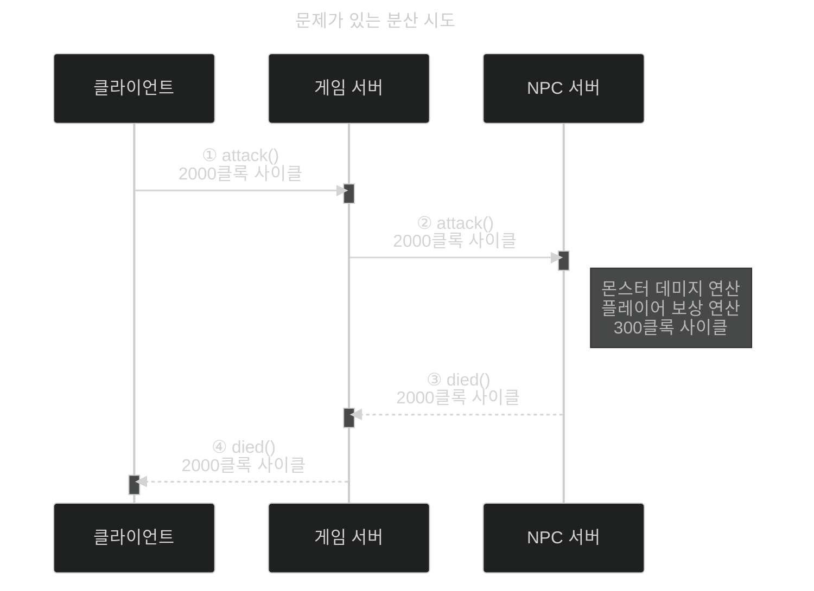
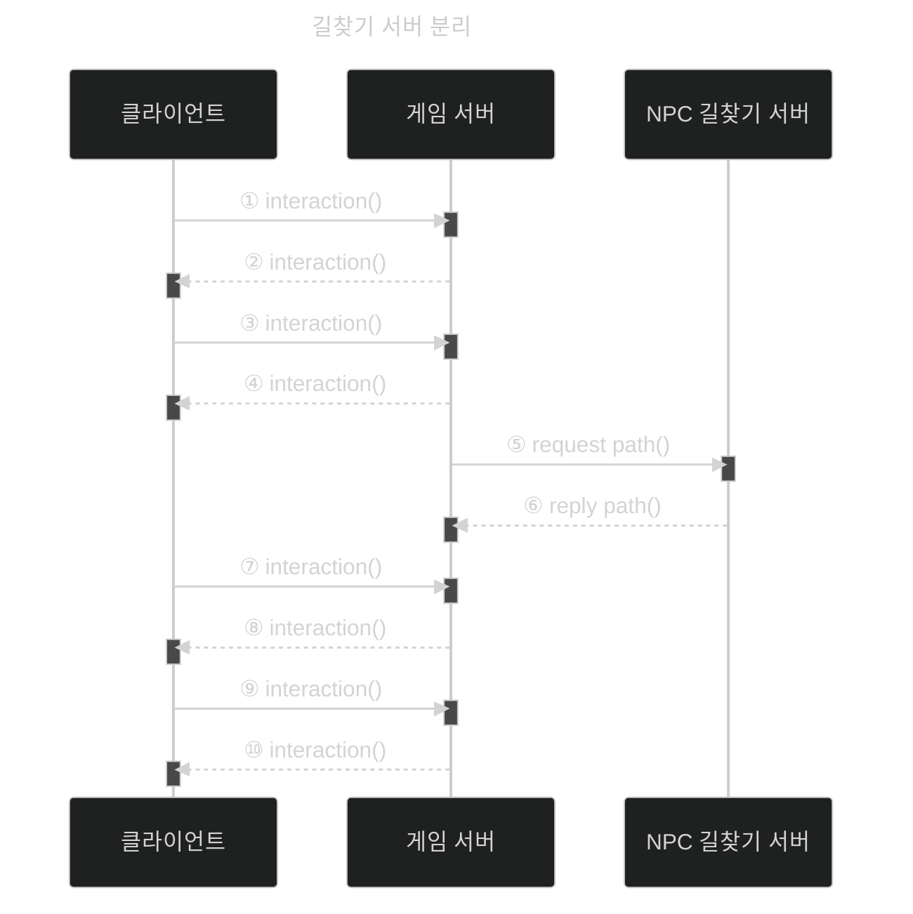

이 글은 아래의 책을 자세히 정리한 후, 정리한 글을 GPT에게 요약을 요청하여 작성되었습니다.  
게임 서버 프로그래밍 교과서, 배현직 저자
{: .notice--warning}

# 📦 10. 분산 서버 구조 사례
## 👉🏻 4. 몬스터 NPC 처리의 분산 처리

### 🎮 일반적인 몬스터 관련 처리

- 몬스터 수가 많아지면, **연산량이 많아진다.**
  - 길찾기 알고리즘이나 이 외의 연산들

---

### ⚠️ 문제가 있는 분산 시도

- 분산하였지만 문제가 있다.
  - **실질 연산 처리량보다 메시지 송수신에 더 많은 자원을 소모**한다.
  - 광역 스킬과 같이 서로 간의 연산이 많은 경우, **엄청난 과부하**가 발생한다.
- 이를 해결하기 위해 먼저 **성능 분석**이 필요하다.
  - 길찾기에 막대한 연산이 들어간다고 가정한다.

---

### ✅ 길찾기 서버 분리

- **길찾기만 기능적으로 분산**할 수도 있다.