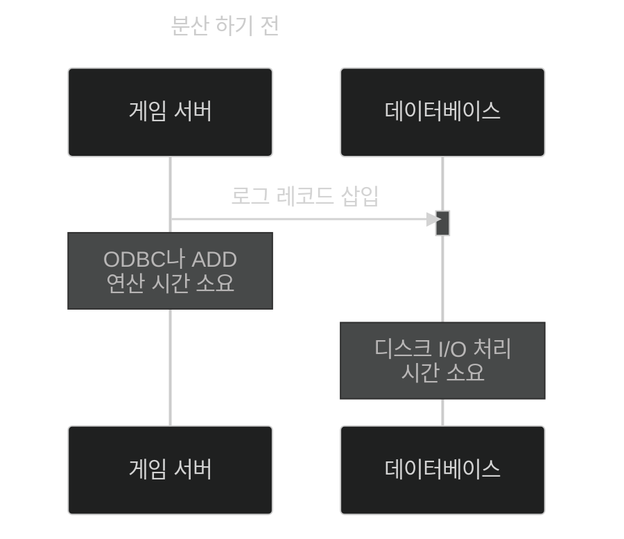
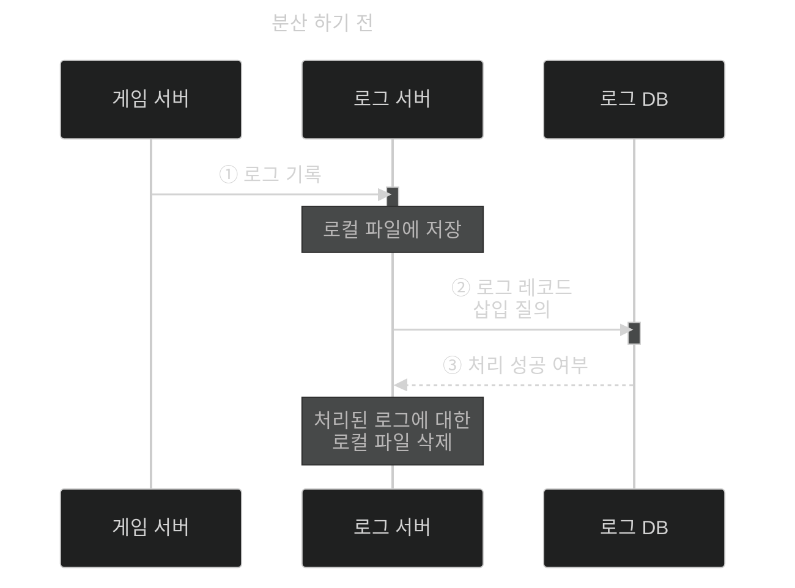

이 글은 아래의 책을 자세히 정리한 후, 정리한 글을 GPT에게 요약을 요청하여 작성되었습니다.  
게임 서버 프로그래밍 교과서, 배현직 저자
{: .notice--warning}

# 📦 10. 분산 서버 구조 사례
## 👉🏻 6. 로그 및 통계 분석의 분산 처리

### 📋 수집 로그 (FPS의 경우)

- 더 나은 게임 서비스를 위해서는 **로그 수집**을 해야 한다.
- 10초마다 **모든 플레이어 위치**
- **가해자/피해자**의 캐릭터 종류, 레벨
- 게임 월드 위에 그려진 **플레이어가 많이 죽는 지역 분포도**
- **플레이어 경험치 증가 곡선**

---

### 📊 성능 요구 사항

- 로그를 **통계 분석(Data Warehousing: DW)** 해서, 게임 제작자에게 제공해야 한다.
- **효율적인 데이터 검색**이 필요하다.
    - e.g. DB에서 원하는 로그 추출
    - DB에 접근하는 것은 오래 걸리므로 **분산해야 한다.**

---

### 🗄️ DB 분산

### 직접 접근 (분산 전)

- **ODBC/ADD:** DB를 액세스하는 프로그램 모듈로, **연산량이 많다.**
- 전반적으로 **오래 걸린다.**

### 분산 후

- 로그는 **신뢰성**을 가져야 한다.
    - **로컬 파일에 저장**해두었다가, 질의를 던지도록 한다.
    - 처리된 로컬 파일을 **삭제**한다.
    - 로그 서버/DB가 꺼졌다가 켜졌다면, 그 사이 **로컬 파일에 쌓인 로그를 처리**한다.

---

### 💡 추가 내용

- **순위 서버, 채팅 서버, 마스터 서버**(서버를 관리하는 서버)를 둘 수도 있다.