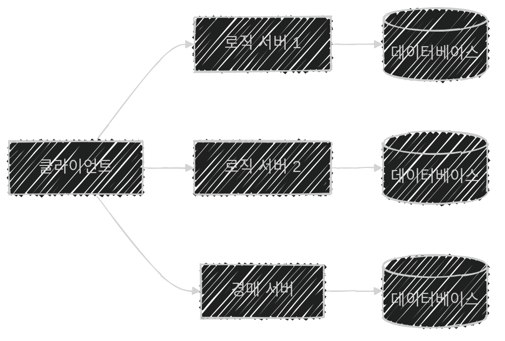
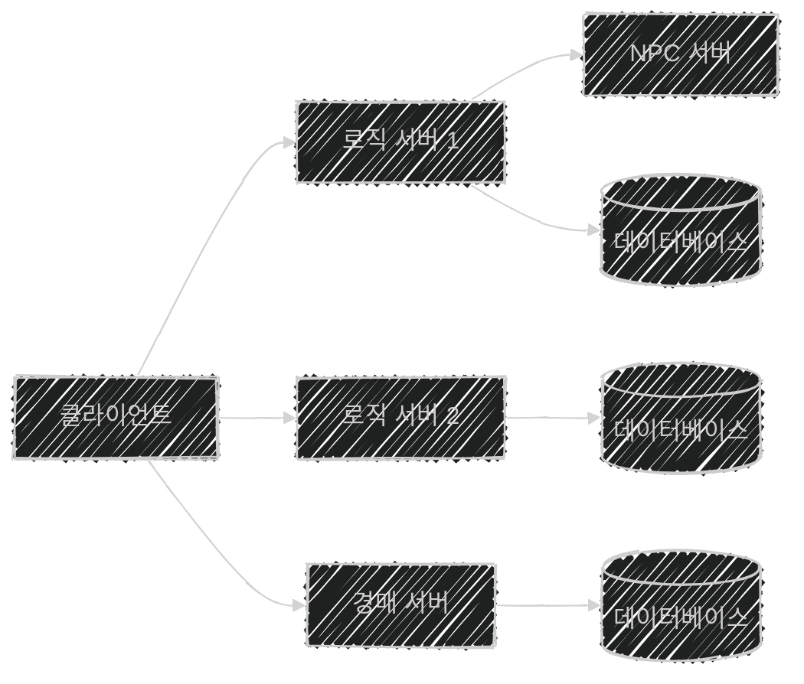
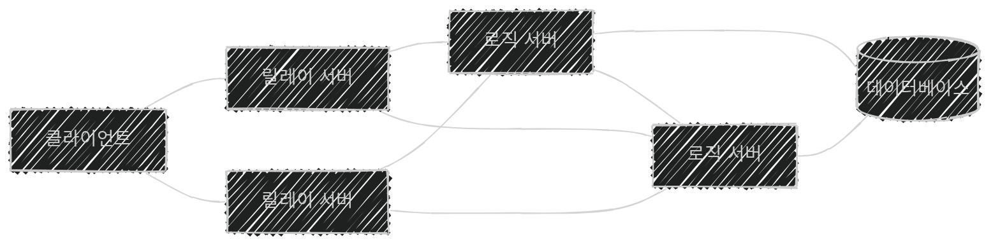
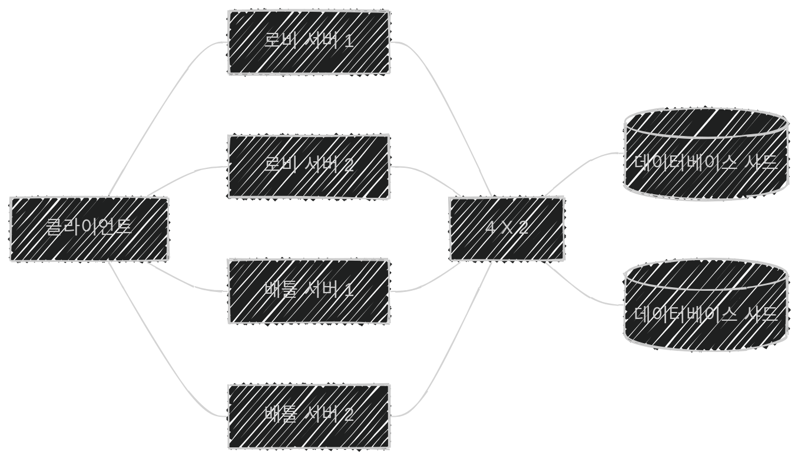
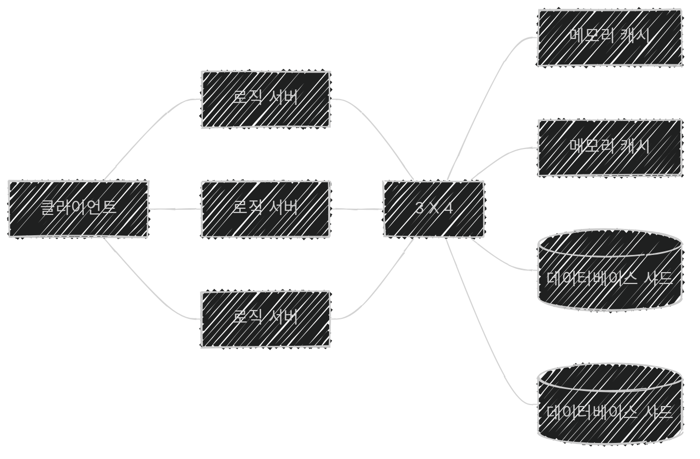

이 글은 아래의 책을 자세히 정리한 후, 정리한 글을 GPT에게 요약을 요청하여 작성되었습니다.  
게임 서버 프로그래밍 교과서, 배현직 저자
{: .notice--warning}

# 📦 10. 분산 서버 구조 사례
## 👉🏻 7. 게임 장르별 분산 서버 형태

### 🗺️ 1. MMORPG: 게임 월드 지역별 분리

- MMORPG 장르의 경우, **게임 월드 지역별**로 분리할 수 있다.

---

### 🤖 2. MMORPG: 지역별 분리 + NPC 로직 분리

- 한 지역에서 **NPC/플레이어 연산**에 과부하가 걸린 경우
- **소켓 I/O**에 과부하가 걸린 경우
    - 클라이언트와 게임 서버 사이에 **패킷 릴레이 서버**를 둔다.
    - 릴레이 서버가 **멀티캐스트를 분담**한다.

---

### 📺 3. MMORPG: 채널 분리 (고전적 분산)

- 소규모 지역별로 나눈다 해도, 한계는 있다.
    - 이 경우, [9.3 고전적인 서버 분산 방법](https://softhamzzi.github.io/gameserver/game_server_9_3/)에서 봤던 **채널을 분리하는 방식**을 사용할 수 있다.

---

### 🌐 4. 심리스 MMO 서버 구조

- **릴레이 서버 + 로직 서버(지역별 분리)** 로 구성한다.
- 광대한 월드에 많은 유저가 있는 경우 (e.g. EVE 온라인)
    - 이 구조가 **유일한 해결책**이다.

- 넓은 월드를 **작은 단위로 나누어** 로직 서버를 구성한다.
- 인접한 지역을 담당하는 로직 서버에 **지속적으로 복제**한다.
- 한 로직 서버에 부하가 몰리면:
    - 인접한 로직 서버로 **일부 넘겨준다.**
    - 담당하는 **지역의 넓이를 줄인다.**

**단점:**

- 서버당 통신량과 OS 레벨 처리량이 증가해, **서버 운영 효율성이 떨어진다.**
- **구현이 더 복잡하다.**
- 로직 서버끼리 복제하는 과정에서 **스테일 문제 혹은 블로킹 문제**가 발생할 수 있다.

---

### 🎮 5. FPS/MOBA: 로비-배틀 수평 확장

- FPS, MOBA와 같이 **대기방이 있어야 하는 게임**에서 사용된다.

- 로비 서버, 배틀 서버, DB 서버 모두 **수평 확장**되어 있다.
- **로비 서버:** 매치메이킹 담당
- **배틀 서버:** 게임 플레이방 담당 (서버끼리 상호작용할 일이 거의 없다.)

---

### 📱 6. SNG (소셜 게임): 메모리 캐시 기반 분리

- **메모리 캐시:** RAM/CPU 캐시에 해당
- **데이터베이스 샤드:** HDD/SSD에 해당
- **SNG 특징**
    - 비교적 플레이어 간 **상호작용 횟수가 적다.**
    - **지연 시간 영향이 적다.**
    - 상호작용해야 하는 **플레이어 범위가 훨씬 넓다.**

---

### 💡 추가 내용

- 분산 서버 구성을 **조합**하기도 한다.
    - e.g. SNG + MMORPG
- 게임 장르가 같더라도, 기획에 따라 분산 서버 형태가 달라질 수 있다.